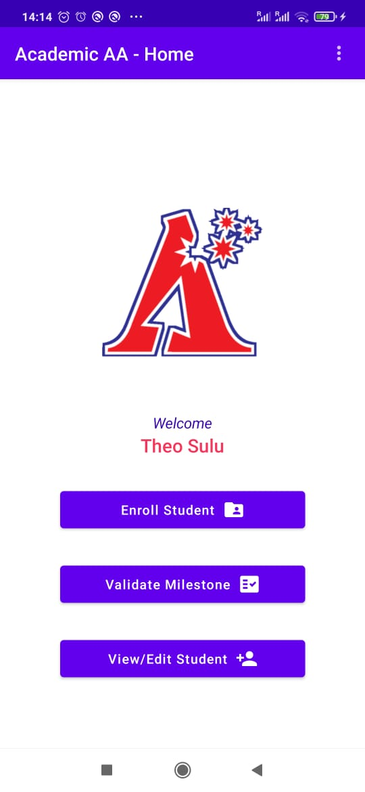
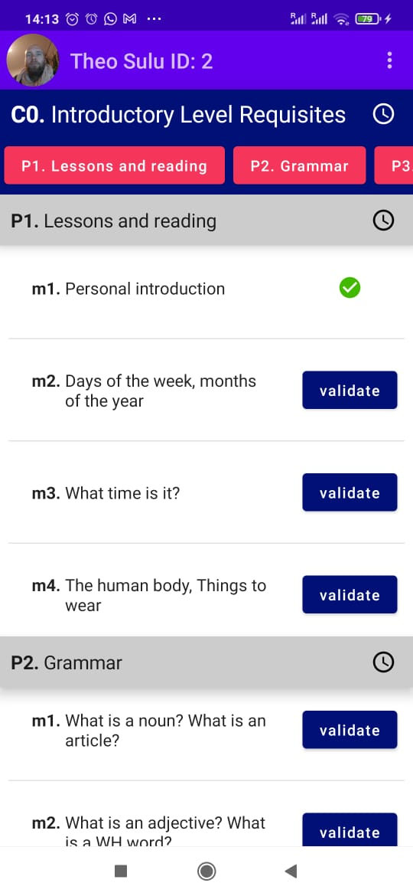
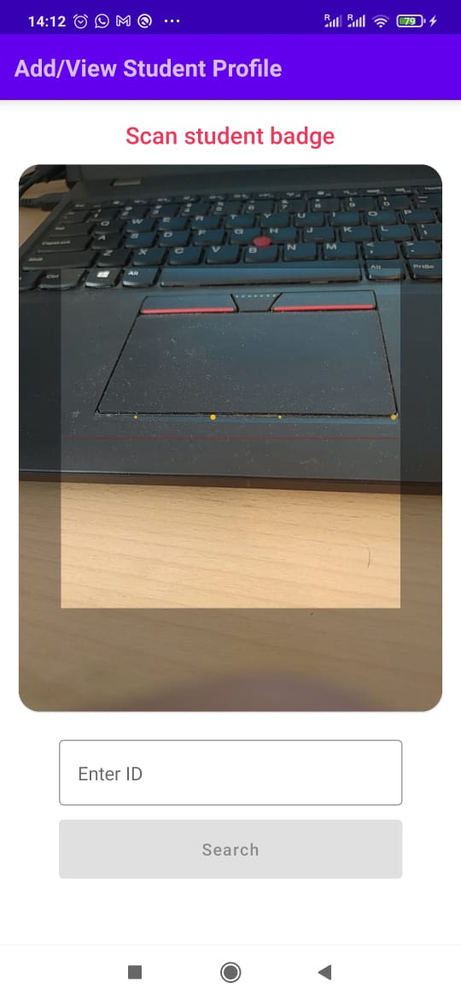
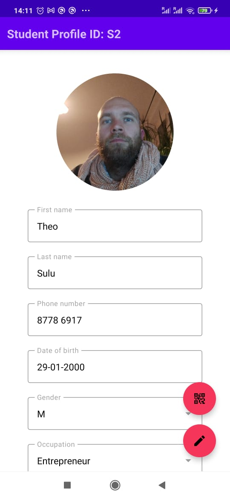

# AcademicAchievement

                                         

An App for English teachers intendes to track the fulfillment of academic milestones by their students:

## Features

- Add/Edit Courses/Parts/milestones
- Add/Edit students' profiles
- Enroll students in courses
- Validate individual milestones (incl. grades, comments and appraiser data)
- Add and revoque access to teachers meant to utilize the app
- most of these features allow quick access to student data via a QR code Scanner that scanns Student IDs generated by the app.

## Tech-Stack
- Firebase (Storage, RTDB, Authentication)
- Jetpack-Compose
- Clean Architecture
- MVVM
